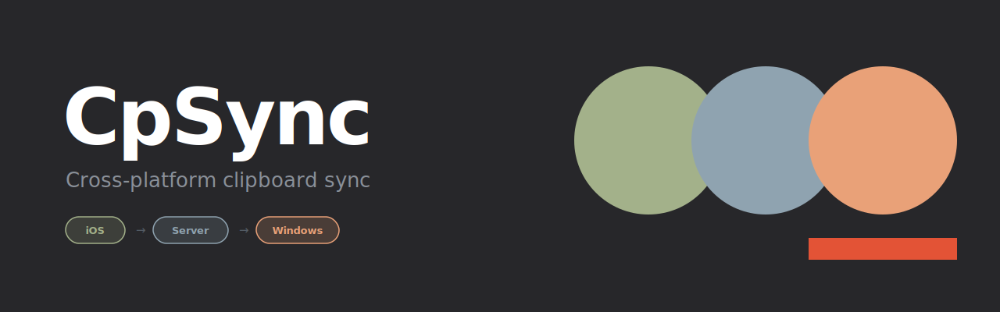

# CpSync



Cross-platform clipboard sync — copy on iOS, paste on Windows instantly.

## How it works

A lightweight WebSocket relay server connects an iOS app to a Windows tray client. Both sides share a **room secret** to pair with each other. When you copy something on iOS, it appears in your Windows clipboard within seconds.

```
[iOS App] ──── WebSocket ────► [Server] ────► [Windows Tray]
   copy                         relay              paste
```

## Apps

| App | Stack | Description |
|-----|-------|-------------|
| [`apps/ios`](apps/ios) | Swift / SwiftUI | Monitors clipboard and sends changes over WebSocket |
| [`apps/server`](apps/server) | Python / aiohttp | Self-hosted WebSocket relay server |
| [`apps/windows`](apps/windows) | Python | System tray app that receives and writes to clipboard |

## Setup

### 1. Server

Deploy anywhere that runs Python (VPS, Railway, Render, Fly.io…).

```bash
cd apps/server
pip install -r requirements.txt
python server.py
```

The server reads the port from the `PORT` environment variable (defaults to `8765`).

### 2. Windows

```bash
cd apps/windows
pip install aiohttp pyperclip pystray pillow windows-toasts
python clipboard_tray.py
```

On first launch a dialog asks for your server host and room secret. Config is saved locally in `config.json`.

### 3. iOS

Open `apps/ios/CpSync.xcodeproj` in Xcode and run on your device. On first launch the Settings screen opens — enter your server URL and room secret.

## Security

- The room secret is never stored in code — it is entered at runtime and kept on-device only.
- The server is a stateless relay: it never stores clipboard content, only forwards messages between peers in the same room.
- Use a strong, random room secret to prevent unauthorized access.

## License

MIT
